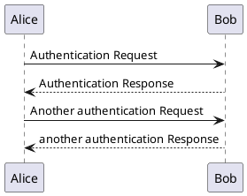

# docsify插件

###   查询

```
<script src="vendor/plugins/search.js"></script>

 search: {
        maxAge: 3600000, // 过期时间，单位毫秒，默认一天,此时一个小时
        paths: 'auto',
        placeholder: '搜索',
        noData: '没有记录！'
      }
```

### 分页
```
<script src="vendor/plugins/docsify-pagination.min.js"></script>

pagination: {
        previousText: '上一章节',
        nextText: '下一章节',
      },

```

###   plantuml图
```
<script src="vendor/plugins/docsify-plantuml.min.js"></script>

plantuml插件使用[https://github.com/imyelo/docsify-plantuml]
···plantuml
@startuml
Alice -> Bob: Authentication Request
Bob --> Alice: Authentication Response

Alice -> Bob: Another authentication Request
Alice <-- Bob: another authentication Response
@enduml
···

```



###   code copy按钮
```
<script src="vendor/plugins/docsify-copy-code.min.js"></script>
```

