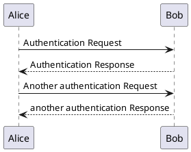

# Basic分区

### plantuml插件使用[https://github.com/imyelo/docsify-plantuml]

```plantuml
@startuml
Alice -> Bob: Authentication Request
Bob --> Alice: Authentication Response

Alice -> Bob: Another authentication Request
Alice <-- Bob: another authentication Response
@enduml
```